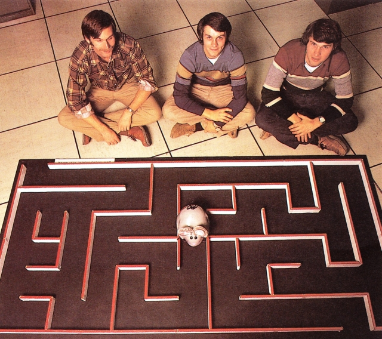

# Conhecimentos Elementares

Lorem ipsum dolor sit amet, consectetur adipiscing elit, sed do eiusmod tempor incididunt ut labore et dolore magna aliqua. Ut enim ad minim veniam, quis nostrud exercitation ullamco laboris nisi ut aliquip ex ea commodo consequat. Duis aute irure dolor in reprehenderit in voluptate velit esse cillum dolore eu fugiat nulla pariatur. Excepteur sint occaecat cupidatat non proident, sunt in culpa qui officia deserunt mollit anim id est laborum.

## O Concurso Micromouse 

Sed ut perspiciatis unde omnis iste natus error sit voluptatem accusantium doloremque laudantium, totam rem aperiam, eaque ipsa quae ab illo inventore veritatis et quasi architecto beatae vitae dicta sunt explicabo. Nemo enim ipsam voluptatem quia voluptas sit aspernatur aut odit aut fugit, sed quia consequuntur magni dolores eos qui ratione voluptatem sequi nesciunt. Neque porro quisquam est, qui dolorem ipsum quia dolor sit amet, consectetur, adipisci velit, sed quia non numquam eius modi tempora incidunt ut labore et dolore magnam aliquam quaerat voluptatem. Ut enim ad minima veniam, quis nostrum exercitationem ullam corporis suscipit laboriosam, nisi ut aliquid ex ea commodi consequatur? Quis autem vel eum iure reprehenderit qui in ea voluptate velit esse quam nihil molestiae consequatur, vel illum qui dolorem eum fugiat quo voluptas nulla pariatur?

### As Origens 

1977 - A IEEE Spectrum Magazine apresentou o conceito de Micromouse 

<figure>
    
    <figcaption>A single track trail outside of Albuquerque, New Mexico.</figcaption>
</figure>

Em maio de 1977, a revista Spectrum do IEEE anunciou a 'Amazing Micromouse Maze Contest', 

Milhares de participantes inscreveram-se para esse ano inaugural de 1977, mas, para as primeiras tentativas, apenas cinco concorrentes tinham os seus robôs prontos, e apenas dois dos ratos (micromouse) completaram o labirinto. 

Enquanto os designers e seus ratos aguçavam suas habilidades, no entanto, 15 ratos competiram com sucesso nas finais do espectro [PDF] na Conferência Nacional de Computação de 1979.

As finais foram cobertas pela CBS, NBC e ABC Television e foram relatadas no noticiário noturno de Walter Cronkite, John Chancellor e David Brinkley. Os recortes da imprensa se acumularam de uma ampla gama de jornais, do International Herald Tribune ao Booneville Daily News, do Missouri. Um mouse vencedor foi retratado na primeira página do Wall Street Journal.

que seria realizada em 1979 em Nova York. Havia 15 concorrentes sem cerca de 6000 entradas iniciais.
Esta competição invasou os ratos encontrando o caminho de 10 'por 10'.
Quando a competição foi realizada, o vencedor foi um seguidor de parede burro de alta velocidade.
1980
O professor John Billinsley, da Portsmouth Polytechnic, modificou as regras e introduziu a primeira competição européia - realizada em Londres em Euromicro. As mudanças de regra exigiam que os ratos encontrassem uma meta no centro do labirinto e os seguidores da parede pudessem impedir que encontrassem o objetivo. Havia 200 atividades e 100 entradas, mas apenas 9 ratos nas finais. O mouse esterlino de Nick Smith se tornou o primeiro micro -cromouse (e naquele ano o único) a encontrar o centro e saber que o fez. Embora o desempenho tenha sido menos que impressionante em cerca de 0,18m/s, foi e ainda é um feito notável.
1981

Na exposição Micro Expo em Paris, havia o calor da competição Micromouse. Cinco ratos estavam presentes. O primeiro lugar foi para Nick Smith com Sterling Mouse, chegando ao centro em menos de 3 1/2 minutos.
A final de Paris viu 13 entradas da competição, das quais apenas oito retiraram o centro. Sterling Mouse conseguiu um tempo de 68 segundos. Alan Dibley teve dois ratos nos oito que foram bem -sucedidos. Dave Woodfield levou o dia com Thumper.
O segundo concurso do Micromouse do Reino Unido foi realizado em Wembly. O Thumper de Dave Woodfield foi o vencedor com o melhor tempo de 47 segundos. O Sterling Mouse de Nick Smith foi colocado em segundo lugar com o melhor tempo de 1min 37s. Alan Dibley ficou em terceiro lugar com o Thezius, que fez duas travessias com o melhor tempo de 2min 27 segundos. Thezius era especialmente interessante, pois o poder de processamento foi fornecido pelo relativamente novo computador pessoal ZX80.
1982
As finais britânicas da competição Euromouse '82 foram realizadas na Feira de Computação do Earls Court em abril. Do campo de sete finais, Alan Dibley levou primeiro e o segundo lugar. O T3 de Alan, o terceiro da família Thezeus, venceu com o melhor tempo de 1min 13 segundos, enquanto o filho de Thezeus conseguiu o melhor tempo de 3 minutos 21seg.
1985
O 'First World Micromouse Competiton' foi realizado em Tsukuba, Japão. Miss foram enviados para o número de países ao redor do mundo, a fim de encaixar entradas. A ampla gama de ratos de todo o mundo competiu. O campeão mundial era Noriko-1 do Japão.
Os seis primeiros lugares foram realizados por entradas japonesas. O sétimo era Dave Woodfield, da Inglaterra, com a Enterprise.
1986

Os EUA tiveram sua primeira competição, realizada em Atlantic City, organizada, acredito, pelo IEE. Dave Otten, do MIT, teve a entrada da competição com o Mitee Mouse I. Infelizmente, veio por último.
1987
O
O IEE World Micromouse Championship em Londres viu 13 Micromice Competng. O vencedor foi Dave Otten, que conseguiu ganhar o primeiro e o segundo prêmio com o Mitee Mouse I e o Mitee Mouse II.
Este também foi o ano do primeiro concurso de Cingapura. O vencedor deste concurso foi o MIR3+ do Nanyang Technological Institute. Este mouse ficou em terceiro na competição IEE UK de 1988 em Londres.
1989
O campeonato do IEE UK, realizado em julho em Londres, foi conquistado por membros de uma equipe de Cingapura que levaram 6 dos 8 lugares. Empresa de Dave Woodfield
Chegou em 5º, enquanto o Mitee Mouse III de Dave Otten foi colocado em segundo lugar.
Todos os três ratos superiores estavam dentro de meio segundo um do outro.
Mais tarde naquele ano, em Octber, veio a primeira competição internacional de Micromouse de Cingapura. Os ratos locais de Cingapura levaram cinco dos sete primeiros lugares.
1992
O sétimo IEE Micromouse Competiton foi realizado em Londres. Nove ratos correram. O vencedor foi Mitee Mouse III com a melhor pontuação geral, embora o vice -campeão, o Mouse Mobile II, de Louis Geoffrey, do Canadá, fez a corrida mais rápida. O terceiro prêmio foi para a Enterprise.
O Motor Mouse 2 do Derek Hall conseguiu uma boa melhor corrida, mas conquistou os pontos de penalidade, assim como Marte 1 de Andrew Gattell.

### A Evolução

### A Atualidade

## A Estrutura de Hardware de um Micromouse 

At vero eos et accusamus et iusto odio dignissimos ducimus qui blanditiis praesentium voluptatum deleniti atque corrupti quos dolores et quas molestias excepturi sint occaecati cupiditate non provident, similique sunt in culpa qui officia deserunt mollitia animi, id est laborum et dolorum fuga. Et harum quidem rerum facilis est et expedita distinctio. Nam libero tempore, cum soluta nobis est eligendi optio cumque nihil impedit quo minus id quod maxime placeat facere possimus, omnis voluptas assumenda est, omnis dolor repellendus. Temporibus autem quibusdam et aut officiis debitis aut rerum necessitatibus saepe eveniet ut et voluptates repudiandae sint et molestiae non recusandae. Itaque earum rerum hic tenetur a sapiente delectus, ut aut reiciendis voluptatibus maiores alias consequatur aut perferendis doloribus asperiores repellat.

### Componentes Principais do Micromouse

### O MicroPontiki

## Ambiente de Desenvolvimento

At vero eos et accusamus et iusto odio dignissimos ducimus qui blanditiis praesentium voluptatum deleniti atque corrupti quos dolores et quas molestias excepturi sint occaecati cupiditate non provident, similique sunt in culpa qui officia deserunt mollitia animi, id est laborum et dolorum fuga. Et harum quidem rerum facilis est et expedita distinctio. Nam libero tempore, cum soluta nobis est eligendi optio cumque nihil impedit quo minus id quod maxime placeat facere possimus, omnis voluptas assumenda est, omnis dolor repellendus. Temporibus autem quibusdam et aut officiis debitis aut rerum necessitatibus saepe eveniet ut et voluptates repudiandae sint et molestiae non recusandae. Itaque earum rerum hic tenetur a sapiente delectus, ut aut reiciendis voluptatibus maiores alias consequatur aut perferendis doloribus asperiores repellat.

## Funções Básicas de Controlo do Micromouse

